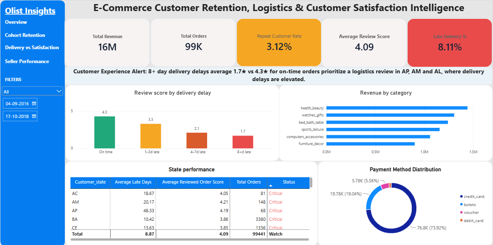

# Olist E-commerce Analytics

E-commerce data analysis project focused on customer retention, delivery performance, customer satisfaction, and revenue using SQL and Power BI.

## Project Overview

This project analyzes the Olist Brazilian E-commerce dataset to understand customer behavior, delivery performance, customer satisfaction, seller and state performance, and product category revenue.

The main goal was to answer practical business questions using SQL for data analysis and Power BI for interactive reporting and visualization.

## Business Questions

The analysis focuses on the following questions:

- How many customers place more than one order?
- What is the repeat customer rate?
- How does delivery delay relate to customer review scores?
- Which states have higher delivery delay rates?
- Which product categories contribute the most revenue?
- Which sellers have higher delivery delays?
- How does customer satisfaction vary across delivery delay groups?
- Which areas may need attention from a business and logistics perspective?

## Dataset

The project uses the Olist Brazilian E-commerce Public Dataset.

The dataset contains information about:

- Customers
- Orders
- Order items
- Payments
- Reviews
- Products
- Sellers
- Geolocation
- Product category translation

The dataset contains approximately 100,000 orders and covers e-commerce transactions from 2016 to 2018.

The original dataset is available on Kaggle:

Olist Brazilian E-commerce Public Dataset

## Tools Used

- MySQL
- Power BI
- DAX
- SQL

## Data Analysis

The data was analyzed using MySQL before building the Power BI dashboard.

The analysis included:

- Customer order frequency
- Repeat customer identification
- Customer retention analysis
- Revenue by product category
- Delivery delay analysis
- Seller performance analysis
- State-level delivery performance
- Review score analysis
- Payment method analysis
- Delivery delay and customer satisfaction analysis

## Customer Retention

Customers were identified using `customer_unique_id` rather than only `customer_id`.

This was important because the same customer can have different customer IDs across orders.

The analysis found:

- Total customers with orders: 96,096
- One-time customers: 93,099
- Repeat customers: 2,997
- Repeat customer rate: 3.12%

The low repeat customer rate indicates that customer retention could be an important area for further investigation.

The project also included cohort-based retention analysis using first purchase dates and 90-day and 180-day retention windows.

## Delivery Performance

Delivery performance was analyzed by comparing the actual delivery date with the estimated delivery date.

The analysis found:

- Delivered orders: 96,476
- Late delivery rate: approximately 8.1%
- Average delay among late deliveries: approximately 8.9 days
- Maximum observed delivery delay: 188 days

Delivery delays were grouped into four categories:

- On time
- 1 to 3 days late
- 4 to 7 days late
- 8 or more days late

## Delivery Delay and Customer Satisfaction

One of the main findings from the analysis was the relationship between delivery delays and customer review scores.

Average review scores by delivery delay group were approximately:

| Delivery Delay | Average Review Score |
| On time | 4.3 |
| 1 to 3 days late | 3.3 |
| 4 to 7 days late | 2.1 |
| 8 or more days late | 1.7 |

The results show a clear association between longer delivery delays and lower customer review scores.

This analysis shows an important customer experience risk, particularly for orders experiencing longer delivery delays.

The relationship should be interpreted as an association rather than proof that delivery delays directly cause lower review scores.

## Revenue Analysis

Revenue was calculated using product price and freight value from the order items data.

The highest-revenue product categories included:

- Health and Beauty
- Watches and Gifts
- Bed Bath Table
- Sports and Leisure
- Computers and Accessories
- Furniture Decor

Total revenue from the analysis was approximately 16 million.

## State Performance

State-level analysis was used to compare delivery performance and customer satisfaction across different customer states.

The Power BI dashboard includes:

- Average late days
- Average reviewed order score
- Total orders
- Performance status

States were classified into Healthy, Watch, or Critical based on delivery delay and customer review performance.

The purpose of this classification was to make the analysis easier to interpret and identify areas that may require further investigation.

## Payment Method Analysis

The project also includes a breakdown of payment methods used for orders.

The main payment methods include:

- Credit card
- Boleto
- Voucher
- Debit card

Credit card was the most common payment method in the dataset.

## Power BI Dashboard

The Power BI dashboard was designed to provide an interactive view of the main findings.

The dashboard includes:

- Total Revenue
- Total Orders
- Repeat Customer Rate
- Average Review Score
- Late Delivery Percentage
- Delivery delay and review score analysis
- Revenue by product category
- State performance
- Payment method distribution
- State filter
- Date range filter

- 

### Power BI File

[Download the Power BI file](https://drive.google.com/file/d/18CSVuCKyDfK5-YMZ5v6MNbOo_8yr5OSH/view?usp=sharing)

The dashboard is designed around the main business questions rather than displaying only individual charts.

## Key Findings

### 1. Low repeat customer rate

Only 3.12% of customers placed more than one order, which highlights customer retention as an area that may need further investigation.

### 2. Delivery delays are strongly associated with lower reviews

Orders delivered 8 or more days late had an average review score of approximately 1.7 compared with approximately 4.3 for on-time orders.

### 3. Longer delays represent a customer experience risk

The review score continued to decrease as delivery delays increased, making delivery performance an important area for operational review.

### 4. Revenue is concentrated in a few major categories

Health and Beauty, Watches and Gifts, Bed Bath Table, Sports and Leisure, Computers and Accessories, and Furniture Decor were among the highest-revenue categories.

### 5. State-level performance varies

Some states showed much higher average delivery delays than others. These differences can help identify areas that may require a deeper logistics investigation.

## Business Recommendations

Based on the analysis, the following areas could be investigated further:

1. Review logistics performance in regions with consistently high delivery delays.

2. Investigate orders with very large delivery delays to understand whether specific sellers, routes, or operational issues are contributing to them.

3. Focus on customer retention because the repeat customer rate is relatively low.

4. Monitor customer reviews for delayed orders because longer delivery delays are associated with significantly lower review scores.

5. Compare seller-level performance to identify operational issues that may be concentrated among specific sellers.

## DAX Measures

Several DAX measures were created for the Power BI dashboard, including:

- Total Orders
- Total Revenue
- Total Customers
- Repeat Customer Rate
- Average Review Score
- On-Time Delivery Percentage
- Late Orders
- Late Delivery Percentage
- Average Late Days
- Customer Order Count
- Repeat Customers
- One-Time Customers

Calculated fields were also used for customer first purchase dates, purchase months, and delivery delay buckets.

## Project Structure

The repository contains the following project components:

- Power BI dashboard
- SQL analysis queries
- Dashboard screenshots
- Project documentation

## Conclusion

This project was built to practice an end-to-end data analysis workflow using a real-world e-commerce dataset.

The analysis started with understanding the business questions, followed by data exploration and SQL analysis, and then moved into Power BI for interactive reporting and visualization.

The main takeaway from the project is that delivery performance and customer satisfaction are closely associated in the dataset, while the low repeat customer rate highlights a separate opportunity around customer retention.

The dashboard brings these findings together so that business users can explore the results by state and date and identify areas that may need further investigation.
